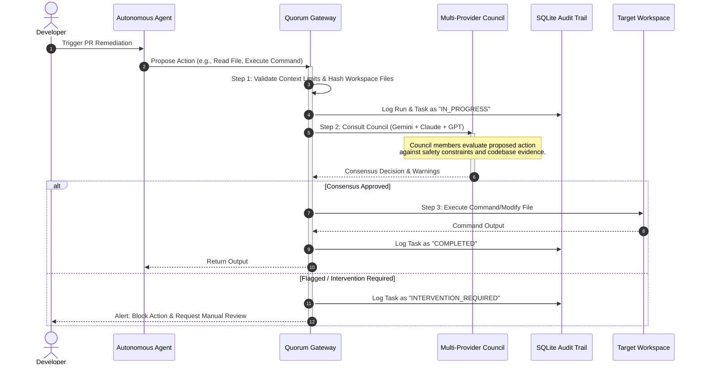

# Quorum: Consensus-Driven Agent Guardrails

Quorum is a decoupled security and validation gateway designed for autonomous developer agents. It addresses the critical trade-off between agent autonomy and system safety, allowing agents to modify codebases and execute tasks without causing approval fatigue or introducing security vulnerabilities.

---

## Core Features

*   **Context-Bound Permissions**: Limits agent workspace access through cryptographic file hashing and boundary validation. This prevents unauthorized directory traversal and content leakage.
*   **Multi-Provider Council Consensus**: Dispatches high-risk action proposals to a council of independent Language Model providers (such as Gemini, Claude, and GPT). Actions are approved or blocked based on a configurable consensus threshold.
*   **Relational Database Auditing**: Maintains a persistent, tamper-evident audit trail of all runs, tasks, and provider attempts in a SQLite database.
*   **Structured Failure Classification**: Dynamically classifies execution errors (e.g., rate limits, timeouts, safety blocks) to coordinate recovery and automated retries.

---

## System Architecture

The security lifecycle consists of three distinct phases:

1.  **Context Validation**: The calling agent submits the execution context and requested files. The system checks file ranges, hashes the contents, and generates a context digest.
2.  **Council Consultation**: The request text and validated context are sent concurrently to the selected LLM providers. Each provider reviews the request against safety contracts and security guidelines.
3.  **Audited Execution**: The results are consolidated. If the consensus voting threshold is met, the command executes. All execution logs, votes, and failure classifications are recorded in the database.



---

## Mathematical Safety Model

Quorum uses multi-model consensus to decrease the risk of security bypasses. Let the probability that a single LLM provider $i$ fails to detect a security vulnerability or safety breach be $p_i \in (0, 1)$.

If the council consults $n$ independent models and requires unanimous approval for an action to proceed, the combined probability of a safety breach $P_{\text{breach}}$ is:

$$P_{\text{breach}} = \prod_{i=1}^{n} p_i$$

For example, assuming a conservative failure rate of $p_i = 0.20$ (a 20% chance that any single model fails to notice a vulnerability), a council of $n = 3$ independent models reduces the breach probability to:

$$P_{\text{breach}} = 0.20 \times 0.20 \times 0.20 = 0.008 \quad (0.8\%)$$

If the system utilizes a majority voting rule (requiring at least $k$ models out of $n$ to approve an action), assuming a uniform model failure rate $p$, the probability of a false approval $P_{\text{false\_approve}}$ follows a binomial distribution:

$$P_{\text{false\_approve}} = \sum_{j=k}^{n} \binom{n}{j} (1 - p)^{j} p^{n-j}$$

---

## Directory Structure

The repository is organized as follows:

*   `config/`: Handles application environment configurations and database paths.
*   `db/`: Implements the SQLite database schemas and service logic for auditing.
*   `documents/`: Contains the pitch deck preparation guides and story files.
*   `engine/`: Contains the core council orchestrator, provider session pool, and runner logic.
*   `mcp/`: Implements Model Context Protocol server endpoints and context validations.

---

## Getting Started

### Installation

Install the project dependencies using npm:

```bash
npm install
```

### Running Commands

To verify TypeScript definitions and compile the codebase, run:

```bash
npm run typecheck
```

To launch the MCP server, run:

```bash
npm run mcp:start
```

### Verification and Smoke Tests

The project includes an automated smoke test that exercises the database initialization, context verification, concurrent task mapping, and council query flows. Execute the test using:

```bash
node --experimental-strip-types smoke_test.ts
```
