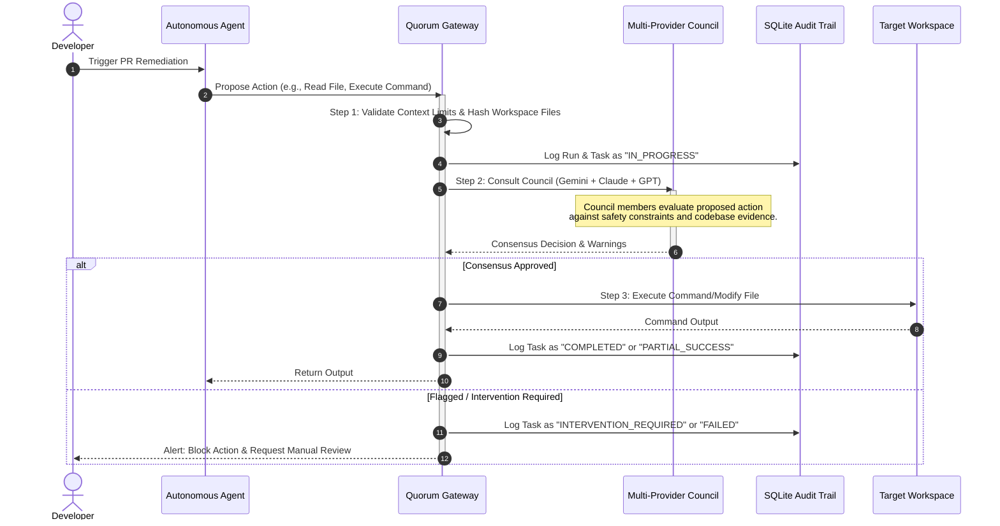

# Pitch Deck: Quorum — Consensus-Driven Agent Guardrails

This document outlines the Pitch Deck for **Quorum**, a solution built for the challenge: **"Trust and permissions for autonomous agents — How might we design permission layers, audit trails, and fail-safes so users can trust agents to act on their behalf?"**

It follows the steps defined in [TheFirst_Spark_Pitch_Deck_Preparation_Steps.md](file:///home/harry/Documents/Github-Projects/the-first-spark-AI4World/documents/TheFirst_Spark_Pitch_Deck_Preparation_Steps.md).

---

## 🏷️ Short Tagline
**"Trust, but consensus-verify: Decoupled multi-model guardrails for autonomous agents."**

---

## ⚡ Elevator Pitch (200 Chars - Business Focused)
Quorum secures autonomous agents by decoupling permission controls. Multi-model consensus verifies proposed actions while automated audit trails eliminate approval fatigue and security risks.

---

## 🎯 The Pitch Spine (Single Sentence Summary)

> We help **Platform and DevSecOps Engineers** who struggle with **approval fatigue and security risk exposure** during **autonomous code-remediation tasks** by solving **the lack of decoupled, multi-model consensus verification and immutable audit logs** through **Quorum, a decentralized validation engine with strict context-bound permissions and relational audit trails** so they can **safely scale autonomous developer agents with complete operational trust**.

---

# 🛝 Pitch Deck Slides

## Slide 1: The Challenge
### Trust and Permissions for Autonomous Agents

Autonomous agents are gaining write access to codebases, databases, and APIs. However, users face a fundamental barrier to adoption: **How can we trust an agent to act on our behalf without exposing ourselves to catastrophic failures?**

*   **The Dilemma**: Complete autonomy leads to security breaches, unintended data modification, and runaway API costs.
*   **The Friction**: Excessive manual checks destroy the velocity gains of using autonomous agents in the first place.
*   **The Mission**: Design a secure permission layer, structured audit trail, and robust fail-safe system that bridges the trust gap between human operators and autonomous systems.

---

## Slide 2: Target User & Use Case
### Platform and DevSecOps Engineers

*   **Target User**: DevSecOps and Platform Engineers responsible for deploying autonomous developer agents (e.g., auto-remediation, PR-review, and auto-patching agents) in enterprise environments.
    *   *Progression*: **Platform/DevSecOps Engineers** (Role) + **deploying code-remediation agents** (Moment) + **who struggle to enforce security bounds and verify actions in real time** (Struggle).
*   **The Specific Use Case**: An autonomous patching agent is triggered by a vulnerability scan (e.g., CVE alert) to rewrite a dependency file, run local test builds, and submit a pull request.
*   **The Trigger**: The agent requests permission to read sensitive config files and run shell commands in the repository.

---

## Slide 3: Pain Point & Bottleneck
### The "All-or-Nothing" Autonomy Trap

*   **The Symptom (Pain Point)**: Platform engineers suffer from **approval fatigue**. They must either manually review every file read/command execution (halting productivity) or blindly grant admin access to the agent (introducing severe risk of hallucinated commands or malicious code changes).
*   **The Root Cause (Core Bottleneck)**: Traditional agent security is **monolithic and self-contained**. The safety checks rely on the agent's *own* self-reflection or system prompts, which are:
    1.  **Easily Bypassed**: Vulnerable to prompt injections.
    2.  **Subject to Hallucination**: Agents believe their actions are safe when they are not.
    3.  **Audit-Blind**: Logs are stored as unstructured text inside the LLM chat history, making programmatic security auditing impossible.

---

## Slide 4: Current Alternatives
### Where Modern Workarounds Fail

Today's methods to secure agents are highly flawed:

| Alternative | How it Works | Why it Fails |
| :--- | :--- | :--- |
| **Micro-Approvals (Human-in-the-Loop)** | Operator approves every single tool invocation. | Causes massive user fatigue; makes automation pointless at scale. |
| **Isolated Sandboxing** | Agents run in highly restricted environments with no API access. | Limits agent utility; agents cannot test actual deployments or write back to repositories. |
| **Single-Model Self-Audit** | The agent's LLM is asked: "Is this action safe?" | Susceptible to jailbreaks, cognitive bias, and hallucination. |

---

## Slide 5: The Solution & Value Proposition
### Quorum: Decoupled Multi-Model Guardrails

**Quorum** secures agent execution by decoupling the authorization and auditing layer from the agent itself. It acts as an independent security gateway:

*   **Strict Context-Bound Permissions**: Restricts agent access to a cryptographically validated, relevance-bounded set of files (preventing unauthorized read/write overreach).
*   **Multi-Provider Council Consensus**: Rather than relying on a single model's self-reflection, Quorum spins up a **Council** of independent LLM providers (e.g., Gemini, Claude, GPT) to vote on proposed changes, verify safety contracts, and raise flags.
*   **Relational Audit Trail**: Every run and task execution is parsed and logged in a persistent SQLite schema, providing clear audit trails and automated failure classification.

---

## Slide 6: How It Works
### The Secure Execution Lifecycle

### Key Technical Mechanisms:
1.  **Context Digest Validation**: Before the council is consulted, the codebase context is hashed and checked for relevance. If the agent attempts to load unapproved files, a validation warning is raised.
2.  **Consensus Voting Engine**: The query is distributed concurrently across a pool of models. If a threshold is crossed (e.g., a member detects a `Likely defect` or `Architectural risk`), the run is paused, and manual review is requested.
3.  **Relational Database Auditing**: Built-in SQLite tables (`Runs`, `Tasks`, `Failures`) keep a precise record of which model approved what action, response times, and failure codes.

---

## Slide 7: Traction & Validation
### Proven in Code

The Quorum architecture is not just a concept—its core components are fully implemented and verified:
*   **Functional API & Engine**: Core components such as `engine/council.ts`, `engine/runner.ts`, and `db/database.ts` are implemented.
*   **Automated Validation Tests**: Features a comprehensive context validation parser (`mcp/contextValidation.ts`) checking repository file ranges and integrity.
*   **Verified by Smoke Test**: The system's concurrency mapping, database recording, and mock provider consultation are validated under `smoke_test.ts`, showing:
    *   Successful multi-threaded task distribution.
    *   Accurate run and task status recording.
    *   Reliable failure classification and database persistence.

---

## Slide 8: The Judge-Readiness Check

Before presenting, we verify that our pitch directly answers the core judging criteria:

*   **[x] Who is this for?**
    *   Platform and DevSecOps Engineers looking to deploy autonomous developer agents safely in their organizations.
*   **[x] What real problem are they facing?**
    *   The "All-or-Nothing" trust barrier: manually reviewing every agent action is exhausting, but granting complete autonomy introduces severe security and operational risks.
*   **[x] What is the bottleneck?**
    *   Agent safety is currently monolithic (contained within the agent's own LLM) and lacks an independent, decentralized consensus validation layer and structured audit logs.
*   **[x] How does the solution remove that bottleneck?**
    *   It decouples the permission and auditing layers. It uses strict context validation to bound file access, a multi-model council consensus to cross-verify action safety, and a relational database to log all decisions.
*   **[x] Why does this meaningfully address the challenge?**
    *   By combining permission layers (Context Validation), audit trails (SQLite DB), and fail-safes (Consensus blocks & automated failure classes), users can confidently trust agents to act on their behalf.
